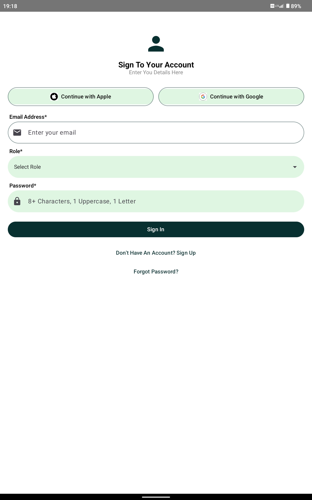
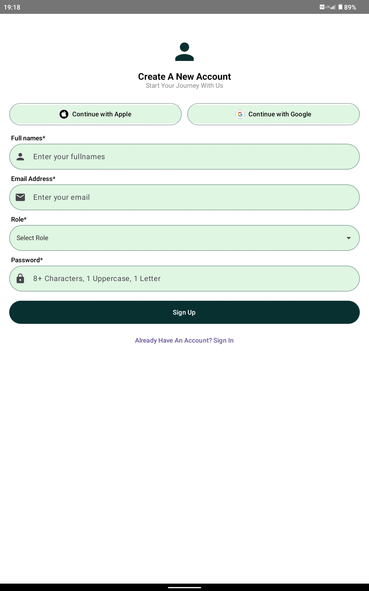
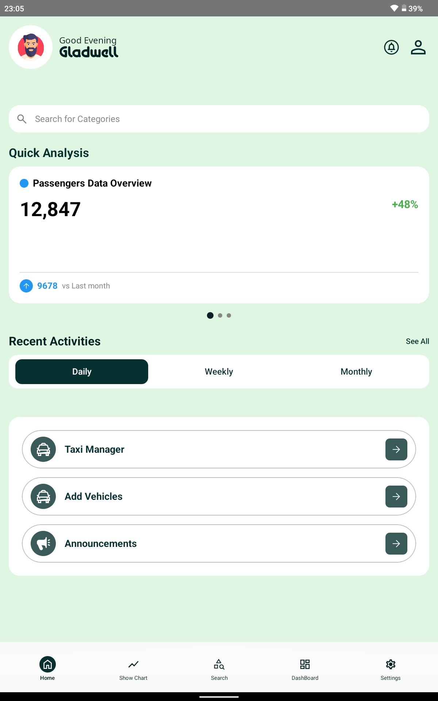
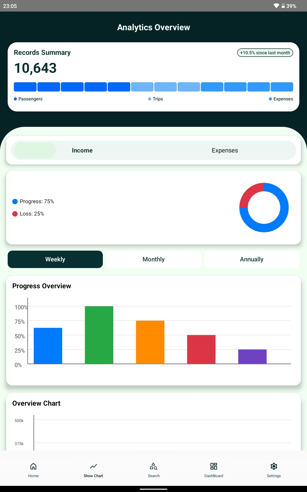
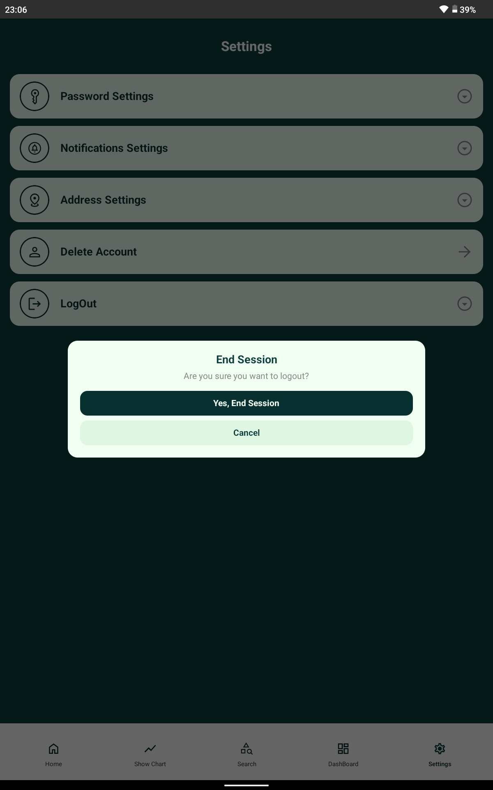

# Software-Development
👨‍💻 Full-Stack Developer | Problem Solver | Tech Enthusiast

## Macro  Projects
 
Mobile Application ( Android Application  )
 
**Objectives :** The Primary aim for this project was to solve real-life problems in the Public Transport in South Africa in all provinces which they face similiar problems to use a Modern way to Run the Industry Smoothly using Our Technology,  which we named it (khulaApp).

- This App shows the Business Data , Dashbaords displays to show Automated Transactions and Imported data.
- Recording Passengers information  
- Making Announcements 
- Track Records
- Users Managements
- Track trips  

## The Interface
This Application was the Combination Of Data Management of a user and Financial Reports of users Bussiness.

## 📸 Application Preview

###  Login Screen

  

### Create Account Screen

  

  

###  Analytics

  

###  LogOut Screen

  
</p
